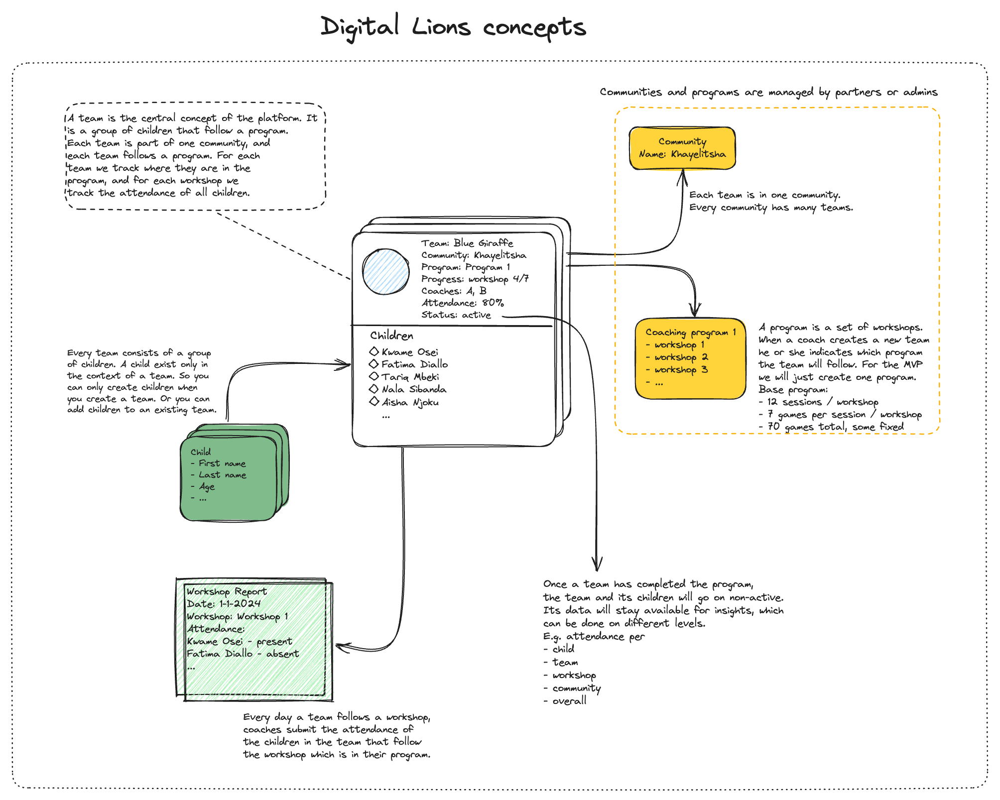

# Digital Lions

POC for a CRUD application for coaches and volunteers of [Little Lions Child Coaching](https://littlelionschildcoaching.com/) to track workshops and classes. Components: frontend (Vue + Bootstrap), backend (Python FastAPI), and PostgresDB. All dockerized and available in development locally with docker compose. Hosted with [Railway Apps](https://railway.app/).


## Development

Everything should just fly. This repo uses [direnv](https://direnv.net/). First copy `.env.template` to `.env`. After that spin up the postgresDB (and optionally pgadmin if you want to inspect the database from the browser):
```bash
docker compose up -d db pgadmin
```
After that spin up the backend (either detached or in separate window):
```bash
docker compose up backend
```
The backend API should now be available at `http://localhost:8000/api/v1/docs#/`. Finally spin up the frontend (either detached or in separate window):
```bash
docker compose up frontend
```
The frontend should now be available at `http://localhost:5173`.

## Endpoint status

Table to track which endpoints exist on the API, whether they are functional, tested, and their payload is correct.

| Endpoint group  | Endpoint                             | Existing | Functional | Tested | Payload/response final |
|-----------------|--------------------------------------|----------|------------|--------|------------------------|
| **Health**      | `GET /health`                        | [ ]      | yes        | yes    | yes                    |
| **Communities** | `POST /communities`                  | [x]      | yes        | yes    | yes                    |
|                 | `GET /communities`                   | [x]      | yes        | yes    | yes                    |
|                 | `PATCH /communities`                 |          | yes        | yes    | yes                    |
|                 | `DELETE /communities/{community_id}` | [ ]      | no         |        |                        |
|                 | `GET /communities/{community_id}`    |          | yes        | yes    |                        |
|                 |                                      |          |            |        |                        |
|                 |                                      |          |            |        |                        |
|                 |                                      |          |            |        |                        |#
## Design

The application is a frontend that talks to a backend API, which in turn talks to a Postgres database. The Postgres Database is designed with the following concepts in mind. Each block in the schematic overview (community, team, children, workshop, attendances, users, program) translates to a table in the databse.


