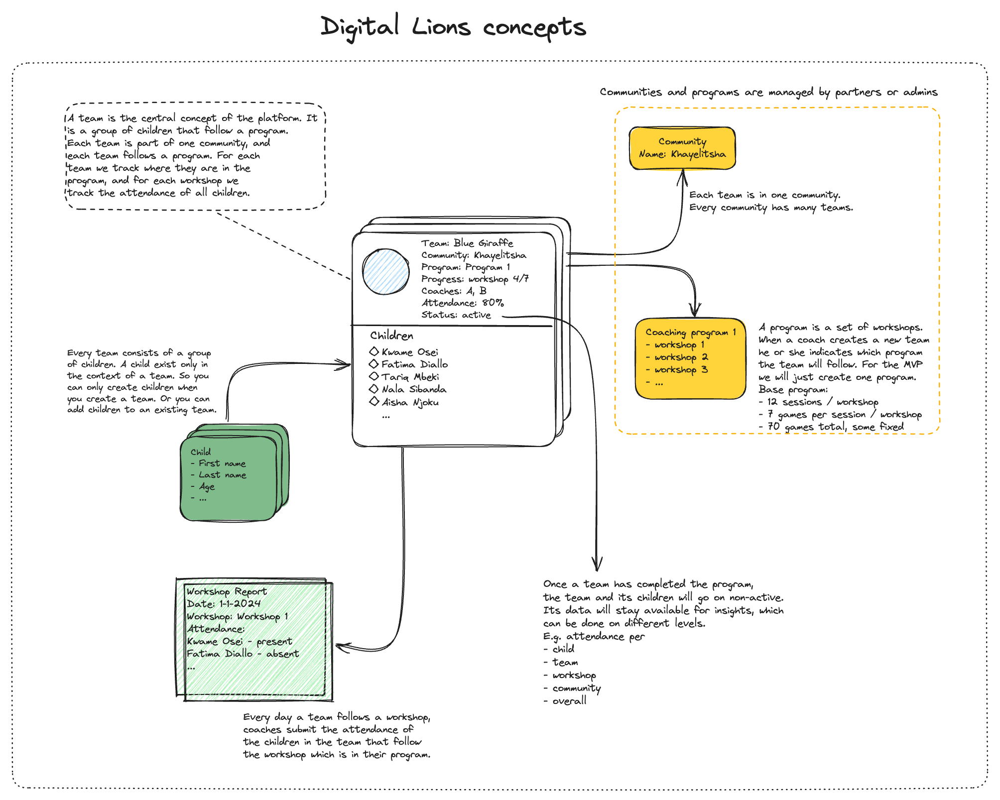

# Conceptual architecture

> June 28th, 2024

The application is a frontend that talks to a backend API, which in turn talks to a Postgres database. The Postgres Database is designed with the following concepts in mind. Each block in the schematic overview (community, team, children, workshop, attendances, users, program) translates to a table in the database.

# Development status

Table to track development status of the endpoints which are heavily under construction.

| **Endpoint group** | **Endpoint**                  | **Method** |     **Present**    |   **Functional**   |     **Tested**     | **To be implemented changes**                                  |
|--------------------|-------------------------------|------------|:------------------:|:------------------:|:------------------:|----------------------------------------------------------------|
| **Health**         | `/health`                     | `GET`      | :white_check_mark: | :white_check_mark: | :white_check_mark: |                                                                |
| **Communities**    | `/communities`                | `POST`     | :white_check_mark: | :white_check_mark: | :white_check_mark: |                                                                |
|                    | `/communities`                | `GET`      | :white_check_mark: | :white_check_mark: | :white_check_mark: | - [ ] add `is_active` to response                              |
|                    | `/communities/{community_id}` | `PATCH`    | :white_check_mark: | :white_check_mark: | :white_check_mark: | - [ ] changing active status on `PATCH` does not work          |
|                    | `/communities/{community_id}` | `DELETE`   |         :x:        |                    |                    | - [ ] full cascading (to be discussed)                         |
|                    | `/communities/{community_id}` | `GET`      | :white_check_mark: | :white_check_mark: | :white_check_mark: |                                                                |
| **Children**       | `/children`                   | `GET`      | :white_check_mark: | :white_check_mark: | :white_check_mark: | - [ ] review response                                          |
|                    | `/children`                   | `POST`     | :white_check_mark: | :white_check_mark: | :white_check_mark: |                                                                |
|                    | `/children/{child_id}`        | `GET`      | :white_check_mark: | :white_check_mark: | :white_check_mark: |                                                                |
|                    | `/children/{child_id}`        | `PATCH`    | :white_check_mark: | :white_check_mark: | :white_check_mark: | - [ ] changing active status on `PATCH` does not work          |
|                    | `/children/{child_id}`        | `DELETE`   | :white_check_mark: | :white_check_mark: |         :x:        | - [ ] cascading                                                |
| **Teams**          | `/teams`                      | `GET`      | :white_check_mark: | :white_check_mark: | :white_check_mark: | - [ ] add `is_active` flag to response                         |
|                    | `/teams`                      | `POST`     | :white_check_mark: | :white_check_mark: | :white_check_mark: |                                                                |
|                    | `/teams/{team_id}`            | `GET`      | :white_check_mark: | :white_check_mark: | :white_check_mark: |                                                                |
|                    | `/teams/{team_id}`            | `DELETE`   | :white_check_mark: | :white_check_mark: | :white_check_mark: | - cascading children implemented, cascading to attendance not yet.                                                           |
|                    | `/teams/{team_id}`            | `PATCH`    |         :x:        |                    |                    |                                                                |
|                    | `/teams/{team_id}/workshops`  | `POST`     | :white_check_mark: | :white_check_mark: | :white_check_mark: | - autoset `in_active` to `False` when `workhshop_number` is 12 |
|                    | `/teams/{team_id}/workshops`  | `GET`      | :white_check_mark: | :white_check_mark: | :white_check_mark: | - response model to be improved                                |
| **Users**          | `/users`                      | `GET`      | :white_check_mark: |         :x:        |                    |                                                                |
|                    | `/users`                      | `POST`     | :white_check_mark: |         :x:        |                    |                                                                |
|                    | `/users/login`                | `POST`     | :white_check_mark: |         :x:        |                    |                                                                |
|                    | `/users/{user_id}`            | `GET`      | :white_check_mark: |         :x:        |                    |                                                                |
|                    | `/users/{user_id}`            | `PATCH`    | :white_check_mark: |         :x:        |                    |                                                                |
|                    | `/users/{user_id}`            | `DELETE`   |         :x:        |                    |                    |                                                                |

In addition, the following components are on the planning:
- [ ] Authentication with API token
- [ ] Content filtering based on roles / scopes in user JWT
- [ ] query parameter on all `GET` endpoints (`community_id`, `active_only`, etc.)
- [ ] proper API documentation
